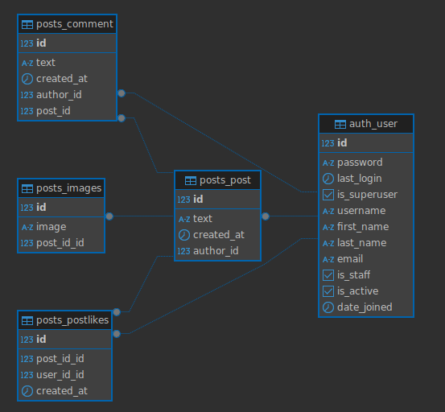

# Дипломная работа профессии «Python-разработчик с нуля»

## Backend приложения для социальной сети для обмена фотографиями


#### Urls

- `/posts/`  - выводит список всех постов, позволяет проводить все операции с ними авторизированным пользователям
- `/posts/<int:post_id>/like/`  - добавляет/удаляет лайк к выбранному посту
- `/posts/<int:post_id>/comment/ ` - добавляет комментарий к выбранному посту
- `/posts/<int:post_id>/comment/<int:comm>/`  - изменяет или удаляет комментарий


#### Модели




## Документация по проекту

Для запуска проекта необходимо:

1. установить зависимости:
```
pip install -r requirements.txt
```

2. выполнить следующие команды:

- команда для применения миграций для базы данных:

```
python manage.py migrate
```

- команда для запуска приложения:

```
python manage.py runserver
```

- при создании моделей или их изменении необходимо выполнить следующие команды:

```
python manage.py makemigrations
python manage.py migrate
```

#### Примеры HTTP-запросов представлены в файле `requests-examples.http`


